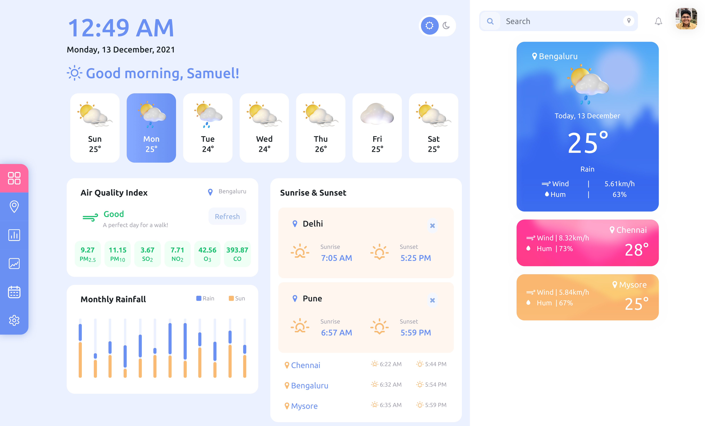

# Assignment 3 - Dynamic Weather App using API
### Full Stack Web Development Internship
#### GEOGO Techsolutions Pvt. Ltd.  
The webpage is made using HTML, CSS, JavaScript, JQuery library, OpenWeather API &amp; Bootstrap framework and deployed on GitHub Pages.
The default city selected to view weather info is **Delhi**. To select a different city, type in the city name and hit enter. The page provides 7-day weather forecast, air quality index and components quantity, sunrise &amp; sunset info. All of this info is provided by OpenWeather API. ***Note***: Monthy Rainfall(Aggregate Statistics) data is accessible to paid users only. For this reason, only free tier services are used for implementation and Monthly Rainfall currently is implemented to show random values(graph levels) for every successful search.
 Visit the deployed website [here](https://prosamva.github.io/GEOGO-FSWDI-A3/ "here").
 
##### Screenshot
